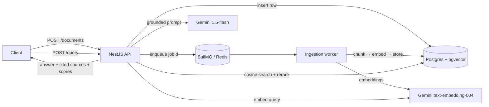

# rag-api

A production-shaped Retrieval-Augmented Generation service: ingest documents
asynchronously, store embeddings in **pgvector**, and answer questions with
**grounded, cited** responses — plus a built-in **eval harness** that measures
retrieval quality.

> **Live demo:** _not deployed_ — run it locally in ~1 minute with `docker compose up` (see Quickstart). The repo is built to be deployed to any Postgres + Redis host (Neon + Upstash free tiers work).

## What this demonstrates

This is not "chat with your PDF." It's the backend a real RAG product is built
on, and it shows the things that separate a toy from a service:

- **Async ingestion** — `POST /documents` returns a `jobId` immediately and does
  the chunk → embed → store work on a **BullMQ** background queue, so the API
  stays non-blocking.
- **Retrieval you can inspect** — `POST /query` runs cosine search in pgvector,
  **reranks** the candidates, and returns the answer **with its source chunks
  and similarity scores**. Nothing is a black box.
- **Evals** — `npm run eval` runs 18 question/keyword pairs through the live
  endpoint and reports retrieval hit-rate, similarity, and latency. Almost no
  portfolio project includes evals; this is how you prove a change actually
  improved retrieval.
- **NestJS + TypeScript, PostgreSQL + pgvector, Gemini** — typed, modular, and
  deployable on free tiers.

## Architecture



Three logical layers: **ingestion** (async pipeline → pgvector), **retrieval +
generation** (cosine search → rerank → grounded answer with citations), and an
**eval harness**.

## Why pgvector over Pinecone

Embeddings live in the **same Postgres** as the documents, so they share one set
of backups, migrations, access controls, and operational tooling — no second
datastore to run, secure, and pay for. A dedicated vector DB earns its keep at
very large scale or extreme QPS; for the corpus sizes most products actually
have, that's complexity you carry without benefit. Keeping vectors in Postgres
is the boring, defensible choice — and if scale ever demands it, swapping the
retrieval layer is a contained change.

## Eval results

Measured against the bundled corpus with the offline fallback embedder (no API
key), `npm run eval`:

```
  Questions:                 18
  Retrieval hit-rate (top-1) 94.4%  (17/18)
  Retrieval hit-rate (top-5) 100.0% (18/18)
  Avg top-1 similarity       0.169
  Avg latency                ~3ms
```

A question is a **hit** when the top retrieved chunk contains its
`expected_keywords`. With Gemini embeddings the semantic quality is higher
again; the harness lets you measure any such change instead of guessing.

## Quickstart

Requires Docker. Works with **no API key** — without `GEMINI_API_KEY` the service
uses a deterministic offline embedder and an extractive answer, so the whole
stack and the eval run for free.

```bash
cp .env.example .env          # optional: add GEMINI_API_KEY for real embeddings + answers
docker compose up -d --build  # Postgres+pgvector, Redis, and the API
npm install                   # for the seed/eval scripts (run on the host)
npm run seed                  # ingest eval/corpus through the async queue
npm run eval                  # measure retrieval hit-rate / similarity / latency
```

API at <http://localhost:8000>. Tear down with `docker compose down` (or `-v` to
drop data).

### curl examples

```bash
# Ingest text (async) — returns a jobId immediately.
curl -s localhost:8000/documents -H 'content-type: application/json' -d '{
  "title": "Release process",
  "text": "We deploy with blue-green. Rollback runs `nwctl rollback` within 5 minutes."
}'
# -> {"jobId":"7","documentId":"…"}

# Or ingest a URL (HTML is stripped to text in the background):
curl -s localhost:8000/documents -H 'content-type: application/json' \
  -d '{"title":"Wiki","sourceUrl":"https://en.wikipedia.org/wiki/Vector_database"}'

# Poll ingestion status.
curl -s localhost:8000/documents/7/status

# Ask a question — answer + cited sources with similarity scores.
curl -s localhost:8000/query -H 'content-type: application/json' \
  -d '{"question":"how do we roll back a deployment?","topK":3}' | jq
```

## API

| Method | Path                    | Description                                       |
| ------ | ----------------------- | ------------------------------------------------- |
| `POST` | `/documents`            | Submit text or a `sourceUrl` for ingestion → `{ jobId, documentId }` |
| `GET`  | `/documents/:id/status` | Poll ingestion job status by `jobId`              |
| `GET`  | `/documents`            | List ingested documents                           |
| `POST` | `/query`                | Ask a question → `{ answer, sources[], latencyMs }` |
| `GET`  | `/health`               | Healthcheck + active provider config              |

`/query` response:

```jsonc
{
  "answer": "Roll back with `nwctl rollback` … [1]",
  "sources": [
    {
      "chunkId": "7d60…",
      "documentTitle": "deployment-and-release",
      "content": "… engineers roll back with the nwctl rollback command …",
      "similarityScore": 0.83
    }
  ],
  "latencyMs": 312
}
```

## Database schema

```sql
CREATE TABLE documents (
  id UUID PRIMARY KEY DEFAULT gen_random_uuid(),
  title TEXT NOT NULL,
  source_url TEXT,
  status TEXT NOT NULL DEFAULT 'pending',  -- operational columns so ingestion
  chunk_count INTEGER NOT NULL DEFAULT 0,  -- is observable (beyond the minimal spec)
  error TEXT,
  created_at TIMESTAMPTZ DEFAULT now()
);

CREATE TABLE chunks (
  id UUID PRIMARY KEY DEFAULT gen_random_uuid(),
  document_id UUID REFERENCES documents(id) ON DELETE CASCADE,
  content TEXT NOT NULL,
  embedding VECTOR(768),               -- Gemini text-embedding-004 dimension
  chunk_index INTEGER NOT NULL,
  created_at TIMESTAMPTZ DEFAULT now()
);
CREATE INDEX ON chunks USING ivfflat (embedding vector_cosine_ops) WITH (lists = 100);
```

## Engineering decisions

**Chunking strategy — paragraph-based, ~512 tokens, 50-token overlap.**
Paragraphs are the unit because sentence splitters shed surrounding context and
fixed-character splits cut mid-word. Whole paragraphs are packed up to ~512
tokens; a paragraph larger than that is hard-split so nothing exceeds the
budget; and consecutive chunks share a 50-token overlap so a fact that straddles
a boundary stays retrievable. (Tokens are whitespace words — a transparent
stand-in for a BPE tokenizer; the budget is sized with headroom.)

**Async ingestion — the "real backend" signal.** `POST /documents` writes a row,
enqueues a BullMQ job, and returns a `jobId` in milliseconds. The worker (in the
same process; scale it out by running more) does the slow work — parse, chunk,
embed, store — with retries and exponential backoff. Ingestion never blocks a
request, and a transient embedding-API failure retries instead of failing the
upload.

**Two-stage retrieval + similarity tuning.** Stage one pulls `RETRIEVAL_TOP_N`
candidates from pgvector by cosine distance (`ivfflat.probes` is raised per
query for recall). Stage two reranks them by blending the vector score with
BM25 lexical overlap, then keeps `RETRIEVAL_TOP_K` as the cited sources — dense
retrieval has great recall but can rank a topically-similar chunk above the one
that literally answers the question, and the lexical signal fixes that cheaply.
Every returned source carries its `similarityScore` so thresholds are tunable
against real numbers (and visible in the eval).

**IVFFlat must be trained on data.** IVFFlat builds its cluster centroids with
k-means *at index-build time*, so an index created on an empty table has
untrained centroids and recall collapses (pgvector even warns about it). The
ingestion worker therefore **rebuilds the index after writing chunks**. That's
fine per-batch at this scale; at larger scale you'd debounce/schedule the
REINDEX or switch to an HNSW index, which needs no training and handles
incremental inserts. This is exactly the kind of pgvector footgun the eval
caught — retrieval silently returned 2 of 6 rows until the index was retrained.

**Gemini, with an offline fallback.** Embeddings use `text-embedding-004` (768-d)
and answers use `gemini-1.5-flash`. When `GEMINI_API_KEY` is unset, a
deterministic feature-hashing embedder and an extractive answer keep the entire
service — and the eval — runnable with no key and no cost, which is also what CI
uses.

## Project layout

```
src/
  documents/        POST /documents, status, list + BullMQ ingestion processor
  query/            POST /query (retrieve → rerank → grounded answer)
  embeddings/       Gemini text-embedding-004 + deterministic offline fallback
  llm/              Gemini 1.5-flash answer generation + extractive fallback
  chunking/         paragraph-aware chunking with overlap
  rerank/           vector-score × BM25 lexical-overlap reranking
  database/         pg pool + pgvector + SQL migration runner
  health/           GET /health
migrations/0001_init.sql
eval/corpus/*.md    source documents
eval/questions.jsonl 18 {question, expected_keywords} pairs
scripts/seed.ts     ingest the corpus via the API
scripts/eval.ts     retrieval hit-rate / similarity / latency
test/               Jest unit tests (chunking, embeddings, rerank, dataset)
.github/workflows/ci.yml  lint + build + unit tests, and a seeded e2e eval
```

## Development

```bash
npm install
npm run lint      # tsc --noEmit
npm run build
npm test          # Jest unit tests (no DB required)
```

CI (GitHub Actions) runs the unit tests **and** a full end-to-end job: it spins
up Postgres+pgvector and Redis, boots the API, seeds the corpus, and runs the
eval — using the offline embedder so it's deterministic and free.

Out of scope by design: multi-format parsing heroics, a UI, and user accounts.
